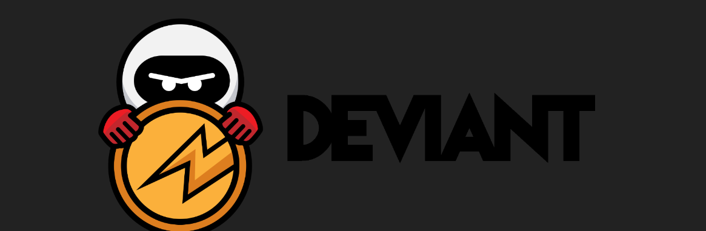

# Deviant-Miscellaneous
Howto, setup guides and scripts
[How to swap zDEV balance](/common/zDEV-swap.md) 

[QT wallet - Preparation steps to run a Deviant Masternode](/common/Preparation-steps-for-MN.md) 

[Wallet - Setup wallet](/common/Setup_wallet.md) 
1. [Setup QT wallet on Windows](/common/Setup_wallet.md#setup-qt-wallet-on-windows) 
2. [Setup Cli wallet Linux](/common/Setup_wallet.md#setup-cli-wallet-linux) 

[Wallet - Deviant Staking Guide](/common/Deviant_staking.md) 
1. [QT wallet](/common/Deviant_staking.md#qt-wallet) 
2. [CLI wallet](/common/Deviant_staking.md#cli-wallet-on-linux) 

[Deviant Masternode setup on Linux VPS](/linux/Masternode_setup.md) 

[Windows - Hot MasterNode under NAT](/windows/Hot-MasterNode-under-NAT.md) 
[Windows - Workaround Hot Masternode issue](/windows/Hot-MasterNode-workaround.md) 
[Troubleshooting](/common/Troubleshooting.md) 
